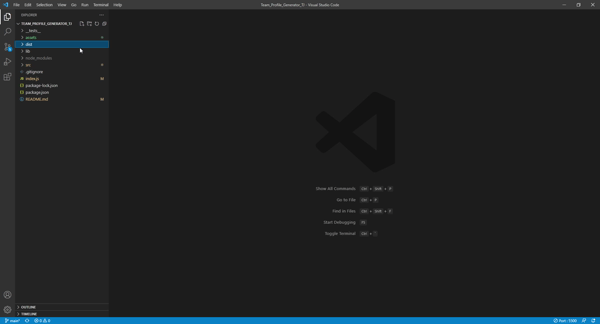

# Team Profile Generator

  

  ## Description

  A node.js based team generator app that creates a HTML file based on the inputs provided by the user. This file then can be loaded into the browser, with styling coming from a provided CSS file

  ## Table of Contents

  - [Description](#description)
  - [Installation](#installation)
  - [Usage](#usage)
  - [Licence](#licence)
  - [Contribution](#contribution)
  - [Tests](#tests)
  - [Questions](#questions)

  ## Installation

  Download the github files Tomjia98's github, install the dependancies

  ## Usage

  To use this project, run the index.js file with node by opening the terminal, and typing "node index.js". Then follow the prompts, and upon completion, copy the dist folder, which contains you newly generated HTML and associated CSS

  ## Licence

  This is free and unencumbered software released into the public domain.

    Anyone is free to copy, modify, publish, use, compile, sell, or
    distribute this software, either in source code form or as a compiled
    binary, for any purpose, commercial or non-commercial, and by any
    means.
    
    In jurisdictions that recognize copyright laws, the author or authors
    of this software dedicate any and all copyright interest in the
    software to the public domain. We make this dedication for the benefit
    of the public at large and to the detriment of our heirs and
    successors. We intend this dedication to be an overt act of
    relinquishment in perpetuity of all present and future rights to this
    software under copyright law.
    
    THE SOFTWARE IS PROVIDED "AS IS", WITHOUT WARRANTY OF ANY KIND,
    EXPRESS OR IMPLIED, INCLUDING BUT NOT LIMITED TO THE WARRANTIES OF
    MERCHANTABILITY, FITNESS FOR A PARTICULAR PURPOSE AND NONINFRINGEMENT.
    IN NO EVENT SHALL THE AUTHORS BE LIABLE FOR ANY CLAIM, DAMAGES OR
    OTHER LIABILITY, WHETHER IN AN ACTION OF CONTRACT, TORT OR OTHERWISE,
    ARISING FROM, OUT OF OR IN CONNECTION WITH THE SOFTWARE OR THE USE OR
    OTHER DEALINGS IN THE SOFTWARE.
    
    For more information, please refer to <http://unlicense.org/>

  ## Contribution

  For contribution guidelines, please contact me directly using my email.

  ## Tests

  run npm test in the terminal to test the class files. You can also run specific test files by using their direct location

  

  ## Questions

  Visit my Github at
  https://github.com/tomjia98

  For any more questions, feel free to contact me at TomChristian1998@gmail.com
  